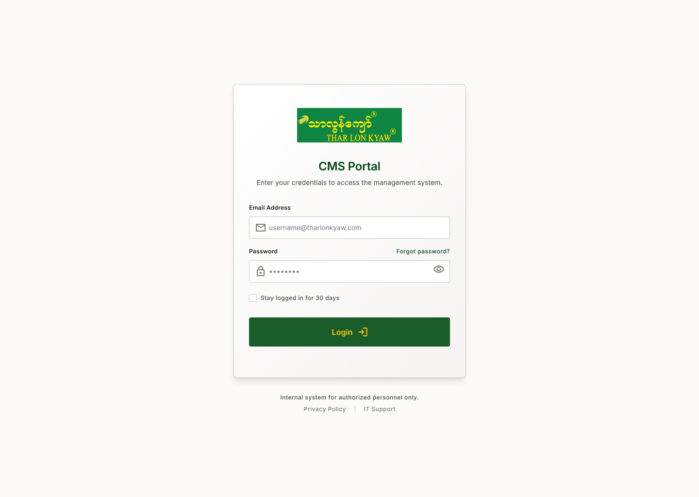
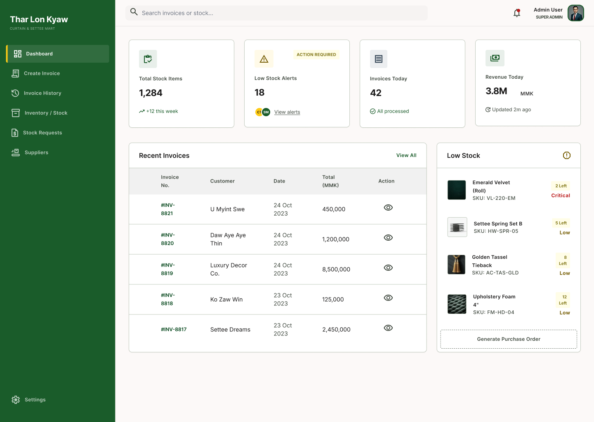
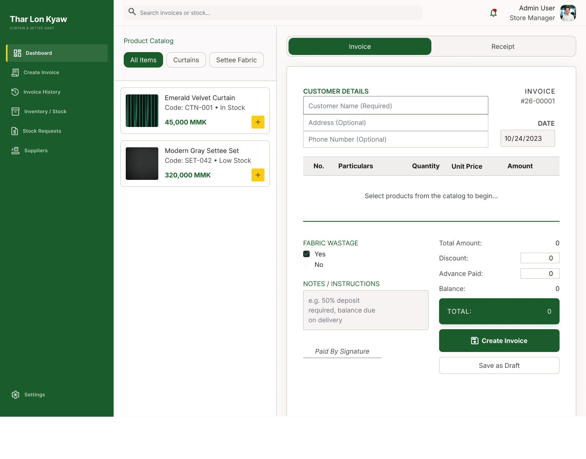
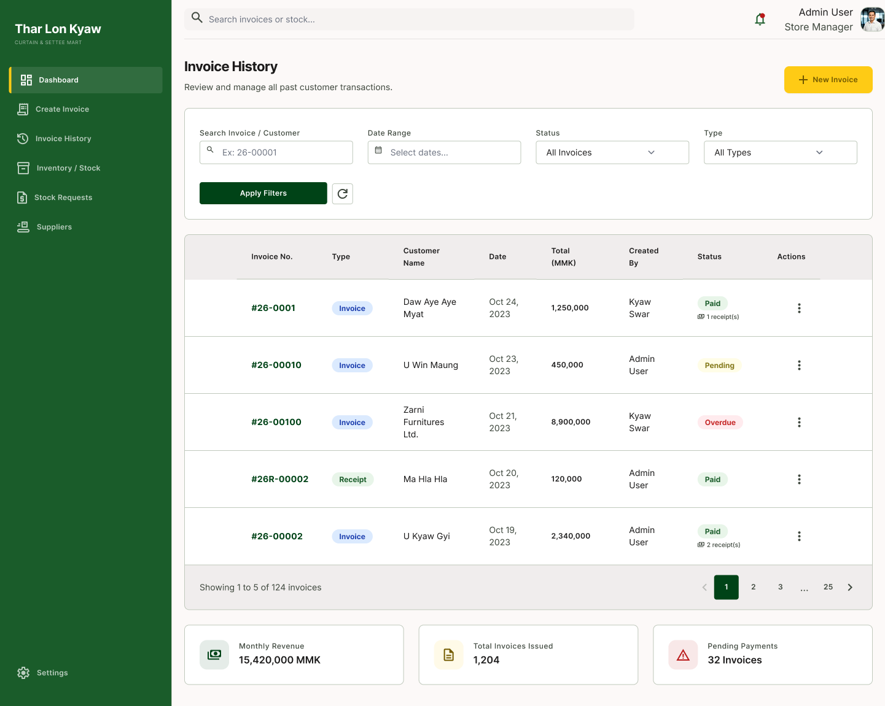
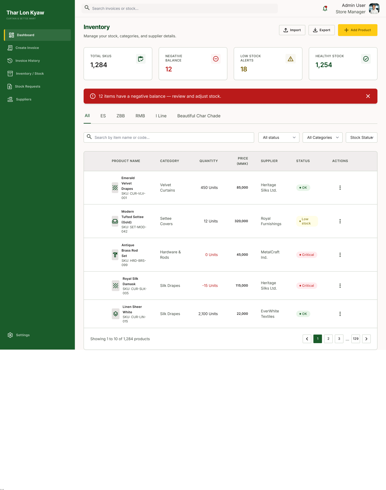
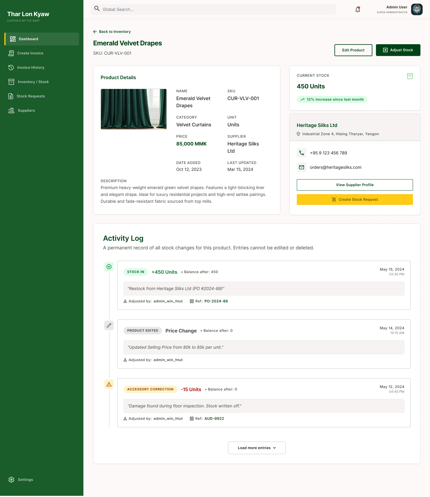
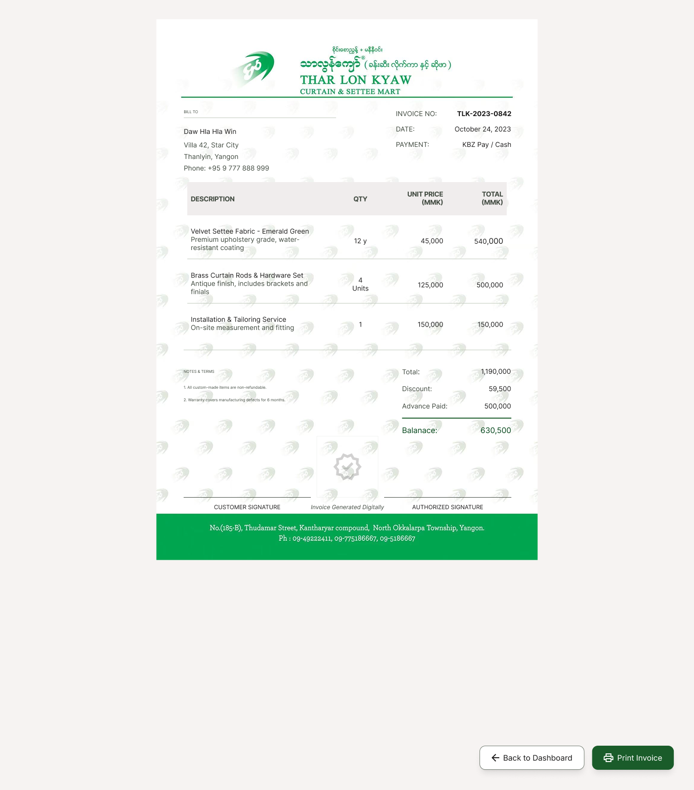

# RetailFlow — Business Management Web App

> A full-stack invoice and inventory management system built for a family-owned retail business in Yangon, Myanmar. Designed to replace paper-based workflows with a fast, intuitive, and role-aware digital system.

---

## Overview

**Thar Lon Kyaw Curtain & Settee Mart** is a retail business in Yangon that previously managed all sales, invoices, and stock records manually on paper. RetailFlow digitises their entire operation into two tightly integrated modules:

- **Sales & Invoicing** — create invoices, record partial and full payments, generate print-ready receipts, and track outstanding balances per customer
- **Inventory & Stock** — manage product catalogue, monitor stock levels in real time, log stock adjustments with a permanent audit trail, and raise stock replenishment requests to suppliers

The two modules are linked transactionally: when a sale is recorded, inventory levels update automatically in the same operation — no manual reconciliation required.

---

## Key Features

- 🔐 **Role-based access control** — three distinct roles with scoped permissions (see below)
- 🧾 **Invoice creation** — product catalog browser, line items, discount, advance payment, balance tracking
- 💳 **Receipt generation** — create payment receipts against existing invoices, with partial payment support
- 📄 **PDF export** — print-ready invoice and receipt documents with company branding
- 📦 **Inventory management** — full product catalogue with SKU tracking, stock status indicators (OK / Low / Critical), and category filtering
- 📋 **Stock requests** — raise and track replenishment requests to suppliers with status pipeline (Pending → Ordered → On the Way → Received)
- 🏭 **Supplier management** — supplier directory with linked products and contact details
- 📊 **Dashboard** — real-time KPIs: daily revenue, invoices today, low stock alerts, recent transactions
- 🗒️ **Activity log** — permanent, immutable record of all stock changes per product (cannot be edited or deleted)
- 🔍 **Global search** — search across invoices, customers, and stock from any page

---

## User Roles

| Feature | Business Owner | Sales | Warehouse Manager |
|---|:---:|:---:|:---:|
| View Dashboard | ✅ | ✅ | ✅ |
| Create / Edit Invoices | ✅ | ✅ | ❌ |
| Create Receipts | ✅ | ✅ | ❌ |
| View Invoice History | ✅ | ✅ | ✅ |
| View Inventory | ✅ | ✅ | ✅ |
| Edit Inventory / Adjust Stock | ✅ | ❌ | ✅ |
| Manage Stock Requests | ✅ | ❌ | ✅ |
| Access Supplier Directory | ✅ | ❌ | ❌ |
| System Settings | ✅ | ❌ | ❌ |

---

## Tech Stack

| Layer | Technology |
|---|---|
| Frontend | Next.js, TypeScript, Tailwind CSS |
| Backend / Database | Supabase (PostgreSQL) |
| Auth | Supabase Auth (role-based) |
| Real-time | Supabase Realtime |
| PDF Generation | *(in progress)* |
| Deployment | *(planned: Vercel)* |

---

## Project Status

| Phase | Status |
|---|---|
| UX Research | ✅ Complete |
| Wireframing & Prototyping (Figma) | ✅ Complete |
| Frontend Development | 🚧 In Progress |
| Backend Integration | 🔜 Upcoming |
| Testing & Deployment | 🔜 Upcoming |

---

## Design & Research

- 📐 [Figma Prototype](https://www.figma.com) *(link coming soon)*
- 📝 [UX Research Report](https://www.notion.so) *(link coming soon)*

The prototype covers 10+ screens including: Login, Dashboard, Create Invoice, Invoice History, Invoice Detail + Receipt View, Inventory Catalogue, Product Detail with Activity Log, Stock Requests, and Supplier Directory.

---

## Screenshots

> Full prototype available in Figma. Selected screens below.

### Login

### Dashboard

### Create Invoice

### Invoice History

### Inventory

### Product Detail & Activity Log

### Printed Invoice

---

## Context & Motivation

Existing business management software in Myanmar is either too expensive for small-to-medium retailers, too complex for non-technical staff to adopt, or not localised for local workflows (e.g. MMK currency, KBZ Pay, partial payment tracking).

RetailFlow was designed from the ground up for this context — starting with user interviews and workflow observation before any design or code was written. Every interface decision is grounded in how the business actually operates, not how a generic SaaS product expects it to.

---

## Roadmap

This project is being built in two phases:

### v1 — Current (Single Business)
A tailored deployment for one specific retail business in Yangon. The system is customised to their product catalogue, workflows, and staff structure. This version establishes the core architecture and validates the product with real users in a real operational environment.

### v2 — Planned (Public SaaS)
A generalised version of RetailFlow for any small-to-medium business to set up and use independently — with a focus on the Myanmar SMB market, including businesses that operate primarily through Facebook and similar platforms.

Key additions planned for v2:
- **Multi-tenant architecture** — each business gets their own isolated workspace
- **Self-service onboarding** — any business can sign up, configure their catalogue, and get started without technical help
- **Mobile-first design** — fully responsive and touch-optimised for users on phones or low-spec devices, since not all small business owners have access to a laptop
- **Localisation** — MMK currency, local payment methods (KBZ Pay, Wave Money, AYA Pay), and Burmese language support
- **Flexible pricing tiers** — designed to be affordable for small retailers who cannot justify enterprise SaaS costs

---

## Development Notes

This repository will be updated as development progresses. The Figma prototype and UX research documentation are available via the links above and represent the complete design specification for the v1 build.

---

*Built by May Phoo Thadar · [mayphoothadar@gmail.com](mailto:mayphoothadar@gmail.com)*
